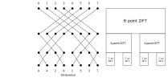

# Cooley-Tukey algorithm

(sampled from Frigo 1999. I changed array indices to $k, l, m$, $n$ denoting the length of the array.)

The (forward) discrete Fourier transform of $X$ is the array $Y$ given by

$$Y[l] = \sum_{k=0}^{n-1} X[k] w_n^{-kl},$$ {#eq:dft}

where 

$$w_n = \exp\left(\frac{2\pi i}{n}\right).$$ {#eq:wn}

So $w_n^{-kl}$ denotes $w_n$ *to the power of* $-kl$.

In the case that $X$ is real valued, $Y$ will have *hermitian symmetry*

$$Y[n - k] = Y^*[k].$$ {#eq:hermitian-symmetry}

The backward DFT flips the sign at the exponent of $w_n$, giving

$$Y[l] = \sum_{k=0}^{n-1} X[k] w_n^{kl}.$$ {#eq:idft}

Now suppose that $n$ can be factored into $n = n_1 n_2$. We may now view the arrays $X$ and $Y$ in a rectangular shape, where

$$X[k] = X[k_1 n_2 + k_2] = X[k_1, k_2].$$

Also, let $Y$ take the transposed shape of $X$,

$$Y[l] = Y[l_1 + l_2 n_1] = Y[l_1, l_2].$$

Then +@eq:dft can be written as

<!-- $$Y[l_1, l_2] = \sum_{k_2 = 0}^{n_2 - 1} \left[\left(\sum_{k_1 = 0}^{n_1-1} X[k_1, k_2] w_{n_1}^{-k_1 l_1}\right) w_n^{l_1 k_2}\right] w_{n_2}^{-l_2 k_2}.$$ -->

$$Y[l_2, l_1] = \sum_{k_2 = 0}^{n_2 - 1} \left[\underbrace{\left(\sum_{k_1 = 0}^{n_1-1} X[k_1, k_2] w_{n_1}^{-k_1 l_1}\right)}_{n_1\text{-point DFT}} \overbrace{\ w_n^{l_1 k_2}\ }^\text{twiddles}\right] w_{n_2}^{-l_2 k_2}.$$

Also known as the **Cooley-Tukey fast Fourier transform**.

This separates the DFT in an inner and outer transform, of sizes $n_1$ and $n_2$. The output of the inner transform is multiplied by **twiddle factors** $w_n^{-l_1 k_2}$, before the outer transform is done.

We approach the FFT algorithm by casting the array to an multi-dimensional array, where each dimension represents one step in the FFT.

{#fig:cooley-tukey}

Another way to illustrate the FFT algorithm is by visualising the data flow.

{#fig:fft-dataflow}

We will refer to the smallest Fourier transform inside an FFT as a **butterfly** operation. In the case of a radix-2 FFT, as illustrated in Figure @fig:fft-dataflow, this is the operation of performing a 2-FT on any two elements within the array, commonly including the multiplication with a twiddle factor.

